```{r setup, include=FALSE}
knitr::opts_chunk$set(echo = FALSE)
```

##
```{r out.width="100%", out.extra='style="display: block; margin: auto"'}
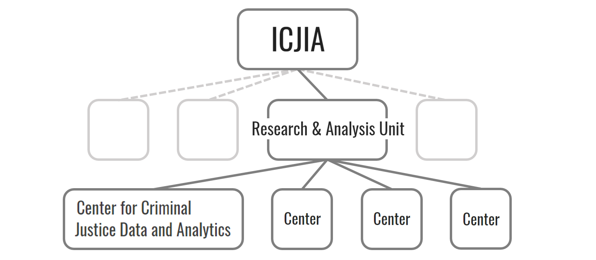
```
<br>
<p class="caption">More on Illinois SAC:
<a href="http://www.icjia.state.il.us/research/overview" target="_blank">
  http://www.icjia.state.il.us/research/overview
</a>
</p>

## This presentation is . . .
* To share our experience, not establish rules
* Focused on study design, not results
* Opinionated, not neutral
<br><br>
<p class="caption">Slides available at
<a href="https://bobaekang.github.io/jrsa2018eastern/slides" target="_blank">
  https://bobaekang.github.io/jrsa2018eastern/slides
</a>
</p>


# Example 1:<br>First-time firearm offenders {data-background-image="image/background1.jpg"}

##
<span style="font-size: .8em; color: #466c8c; font-style: italic;">\#2016-BJ-CX-K024</span>
<div style="font-size: 1.4em">
How do first-time firearm offenders<br>
behave differently?
</div>

## Highlights
* Sample construction
    * Coarsened exact matching
* Combining multiple data sources
    * More nuanced "time to event"

##
```{r out.extra='style="display: block; margin: auto"'}
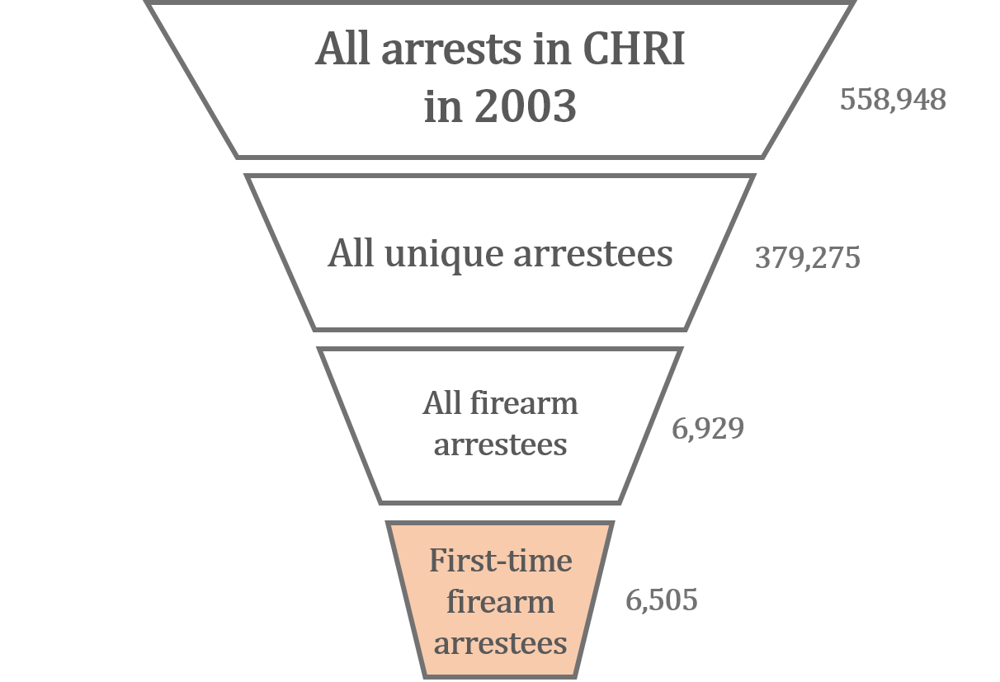
```
<p class="caption">Example 1: Sample construction</p>

##
```{r out.width="60%", out.extra='style="display: block; margin: auto"'}
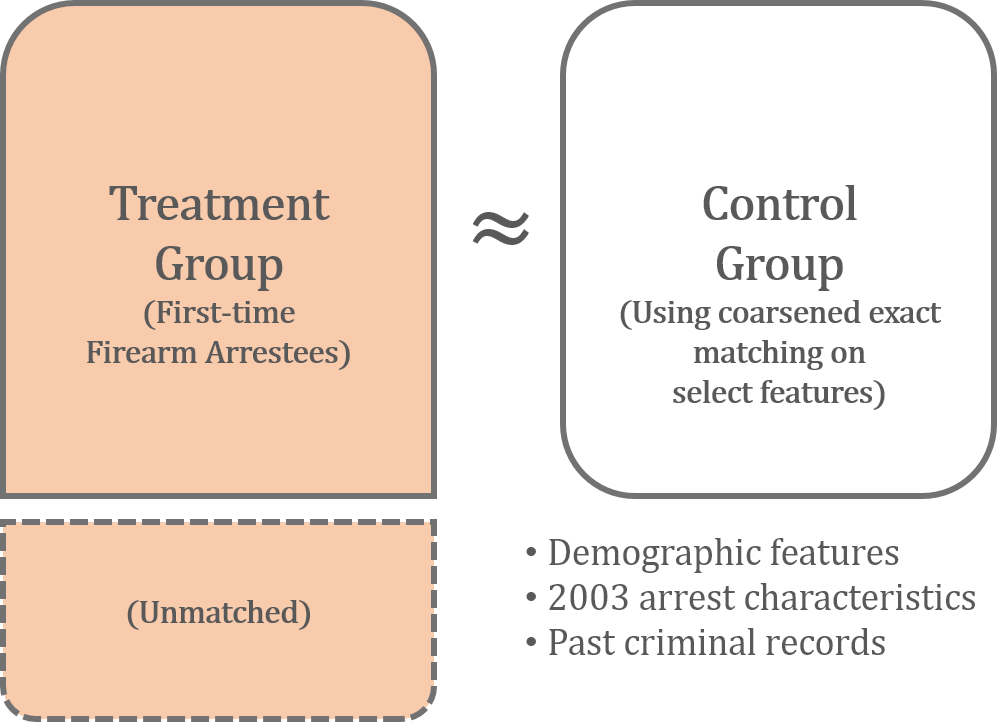
```
<p class="caption">Example 1: Sample construction</p>

##
```{r out.width="90%", out.extra='style="display: block; margin: auto"'}
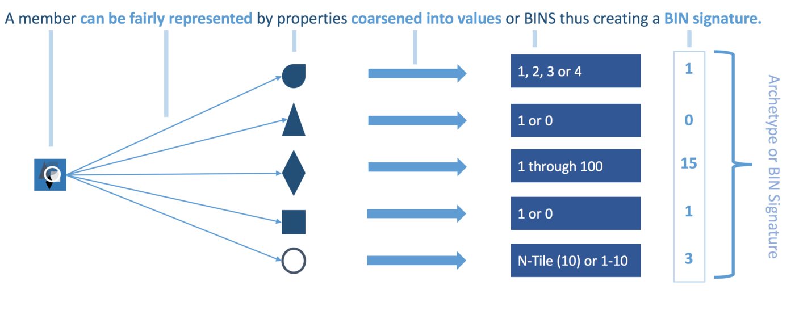
```
<p class="caption">Example 1: Coersened exact matching (
<a href="https://medium.com/@devmotivation/cem-coarsened-exact-matching-explained-7f4d64acc5ef" target="_blank">
  @devmotivation 2017
</a>)
</p>

##
```{r out.extra='style="display: block; margin: auto"'}
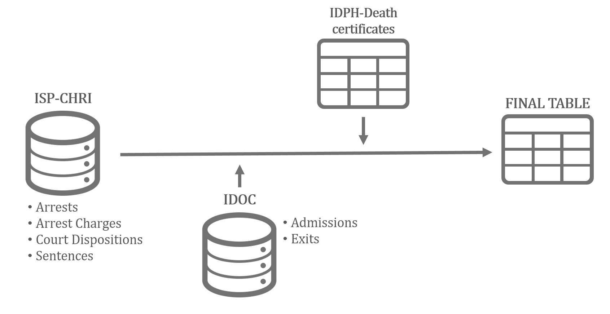
```
<p class="caption">Example 1: Multiple data sources</p>

## {data-transition="concave-in fade-out"}
```{r out.width="95%"}
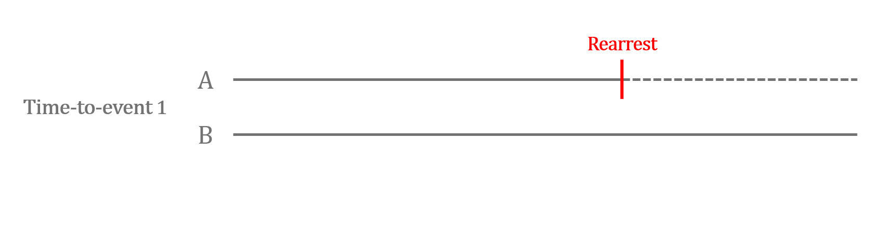
```
<p class="caption">Example 1: Time to event</p>

## {data-transition="fade"}
```{r out.width="95%"}
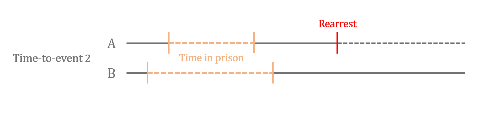
```
<p class="caption">Example 1: Time to event</p>

## {data-transition="concave-out fade-in"}
```{r out.width="95%"}

```
<p class="caption">Example 1: Time to event</p>


# Example 2:<br>Registered sex offenders {data-background-image="image/background2.jpg"}

##
<span style="font-size: 0.8em; color: #466c8c; font-style: italic;">\#2017-BJ-CX-K016</span>
<div style="font-size: 1.3em">
To what extent the registry changes over time?
<br>
Who are the registered sex offenders & what does their criminal history look like?
</div>

## Highlights
* Sex Offender Registry (SOR) table
* Combining multiple data sources
    * More nuanced "current residence"
    * "Criminal history analysis group"

##
```{r out.width="90%", out.extra='style="display: block; margin: auto"'}
knitr::include_graphics("image/pt2_sor.png")
```
<p class="caption">Example 2: SOR table</p>

##
```{r out.extra='style="display: block; margin: auto"'}
knitr::include_graphics("image/pt2_data.png")
```
<br>
<p class="caption">Example 2: Multiple data sources</p>

## {data-transition="concave-in fade-out"}
```{r out.width="90%", out.extra='style="display: block; margin: auto"'}
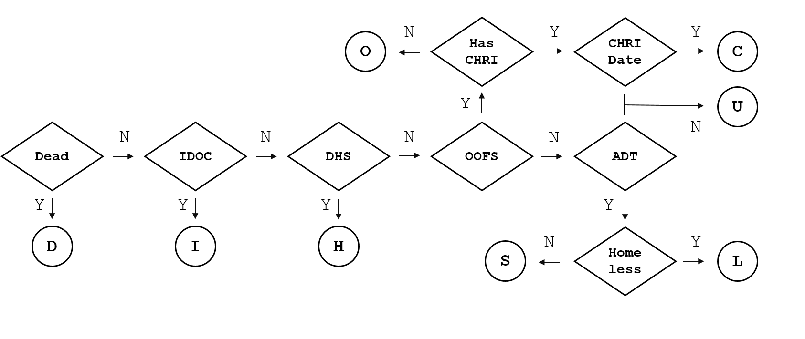
```
<p class="caption">Example 2: Current residence</p>

## {data-transition="concave-out fade-in"}
```{r out.width="90%", out.extra='style="display: block; margin: auto"'}
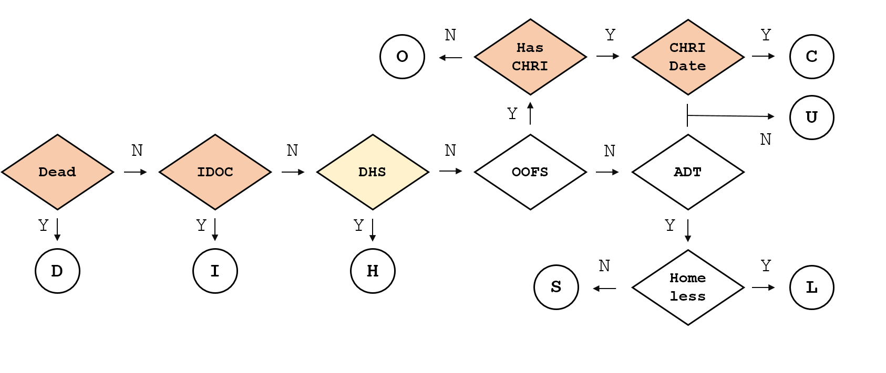
```
<p class="caption">Example 2: Current residence</p>

##
```{r out.extra='style="display: block; margin: auto"'}
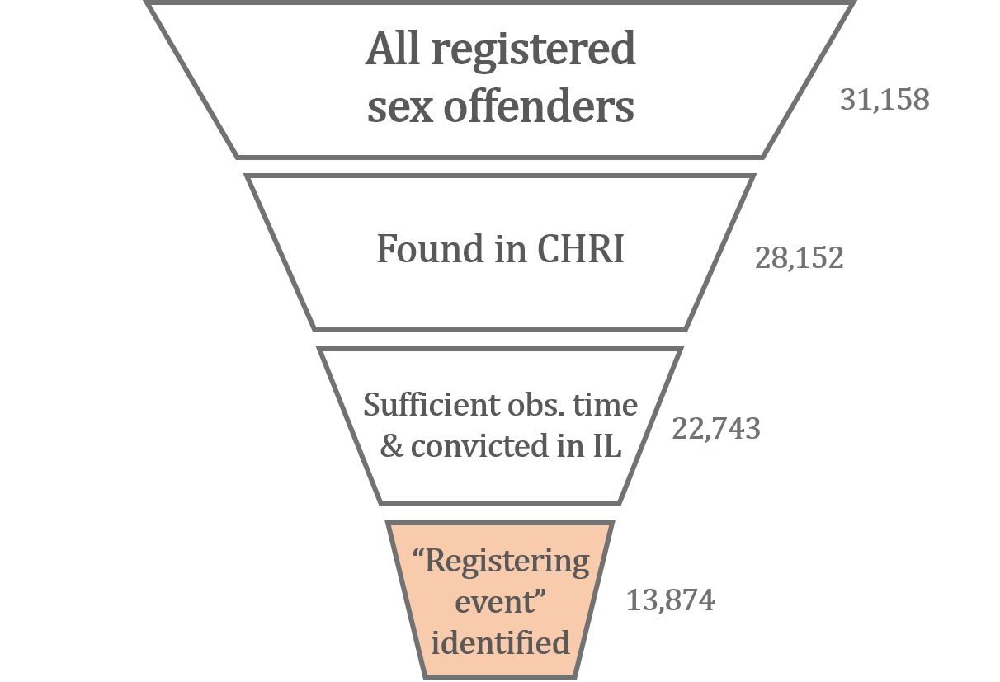
```
<p class="caption">Example 2: Crinimal history analysis group</p>

##
```{r out.width="60%", out.extra='style="display: block; margin: auto"'}
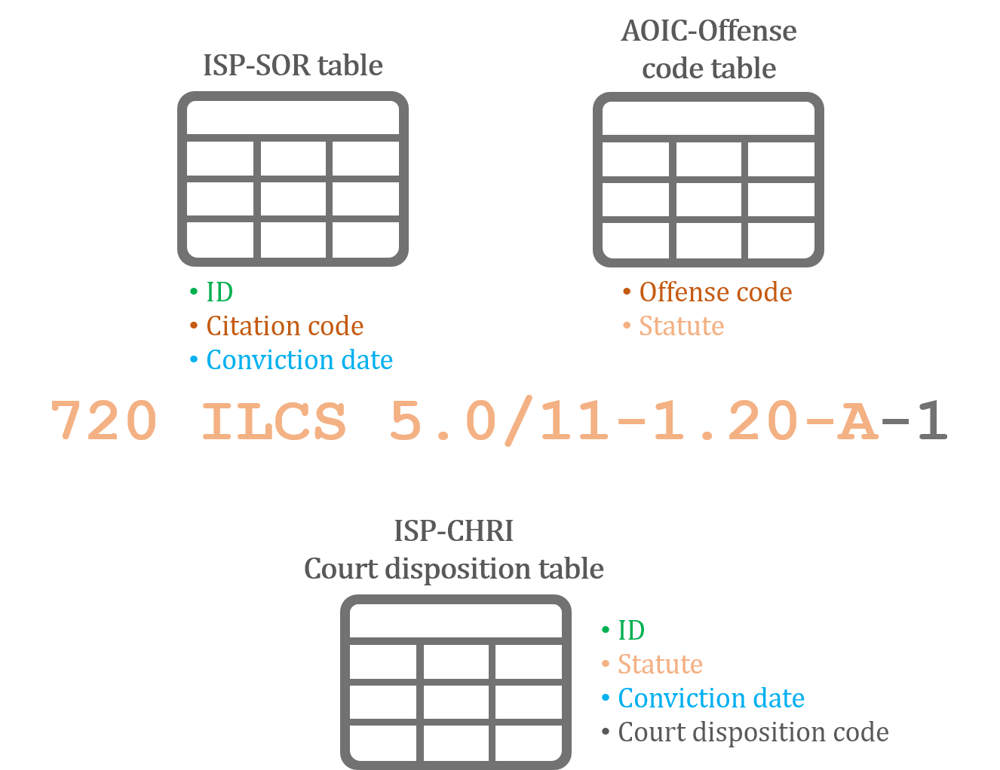
```
<br>
<p class="caption">Example 2: Identifying the "registering event"</p>


# Programmatic approach<br>to research {data-background-image="image/background3.jpg"}

##
<div style="font-size: 1.4em">
A programmatic approach to research<br>
relies on <span style="color:red;"><i>computer programs</i></span><br>
to <span style="color:red;"><i>organize</i></span> and <span style="color:red;"><i>carry out</i></span><br>
research tasks.
</div>

## Basic workflow
1. Set up a research project directory
2. Write and run computer programs to
    * obtain datasets
    * prepare clean datasets
    * conduct analyses
    * generate reports, slides, etc.
3. Share results

##
```{r out.width="65%", out.extra='style="display: block; margin: auto"'}
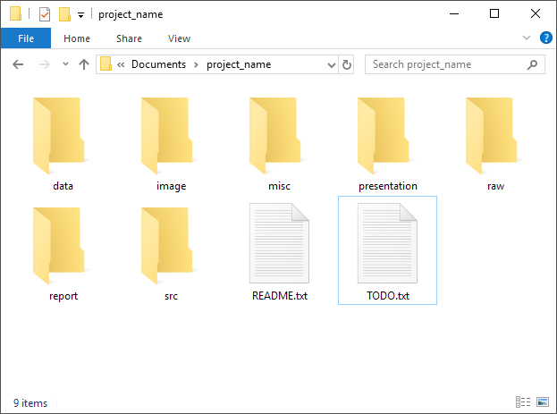
```
<p class="caption">Research directory example</p>

## Key benefits
* Automation
* Flexibility
* Reproducibility

## {data-transition="concave-in fade-out"}
```{r out.extra='style="display: block; margin: auto"'}
knitr::include_graphics("image/Rlogo.png")
```

## {data-transition="concave-out fade-in"}
```{r out.width="80%", out.extra='style="display: block; margin: auto"'}
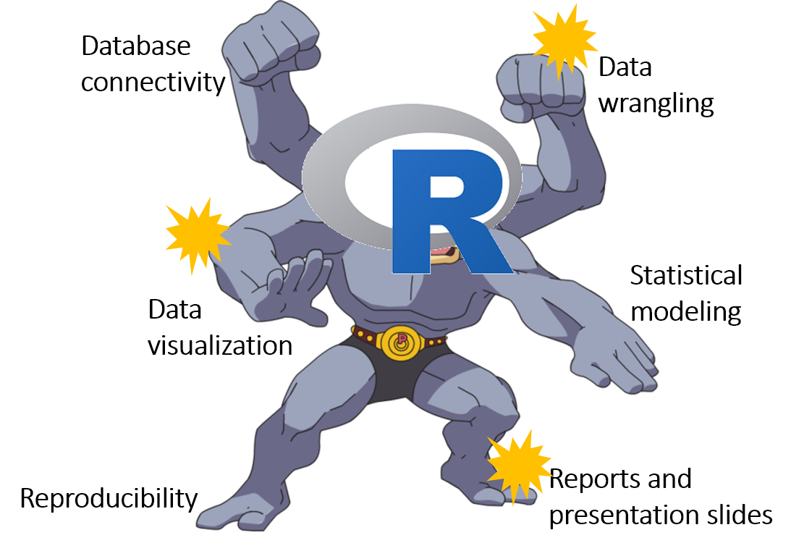
```

# Thank you :) {data-background="white"}

##
<div style="font-size: 0.8em; color: #466c8c; font-style: italic;">
References
</div>
<div style="font-size: 0.6em">
* devmotivation. (2017, April 18). CEM: Coarsened Exact Matching Explained [Medium]. Retrieved from
<a href="https://medium.com/@devmotivation/cem-coarsened-exact-matching-explained-7f4d64acc5ef" target="_blank">
  https://medium.com/@devmotivation/cem-coarsened-exact-matching-explained-7f4d64acc5ef
</a>
* Iacus, S., King, G., & Porro, G. (n.d.). CEM: Coarsened Exact Matching Software. Retrieved from 
<a href="https://gking.harvard.edu/cem" target="_blank">
  https://gking.harvard.edu/cem
</a>
* Morgan, S. & Winship, C. (2015). *Counterfactuals and Causal Inference: Methods and Principles for Social Research* (2nd ed.). New York, NY: Cambridge University Press.
</div>

##
<div style="font-size: 1.2em">
<span style="font-size: 0.8em">Slides</span>
<br>
<a href="https://bobaekang.github.io/jrsa2018eastern/slides" target="_blank">
  https://bobaekang.github.io/jrsa2018eastern/slides
</a>
<br><br>
<span style="font-size: 0.8em">ICJIA R Workshop resources</span>
<br>
<a href="https://bobaekang.github.io/icjia-r-workshop/" target="_blank">
  https://bobaekang.github.io/icjia-r-workshop/
</a>
</div>